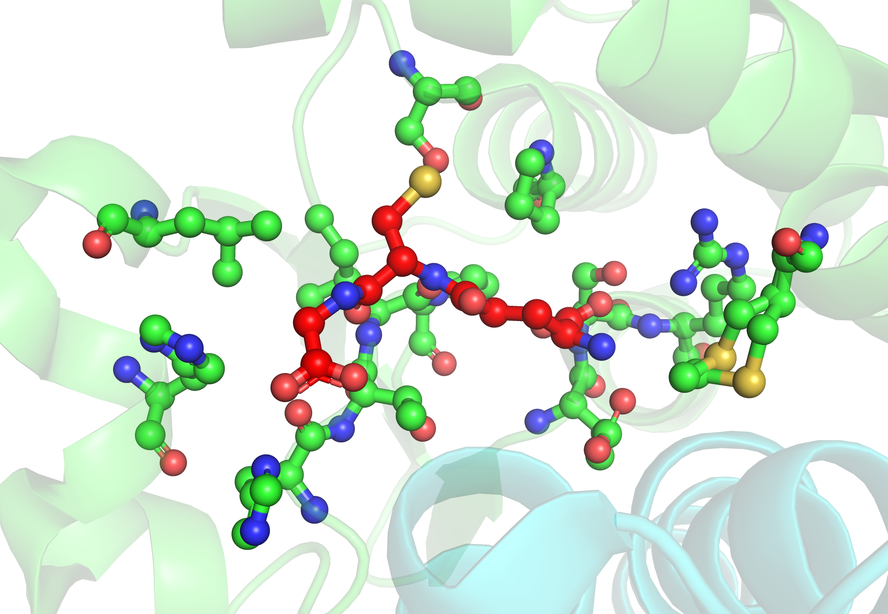
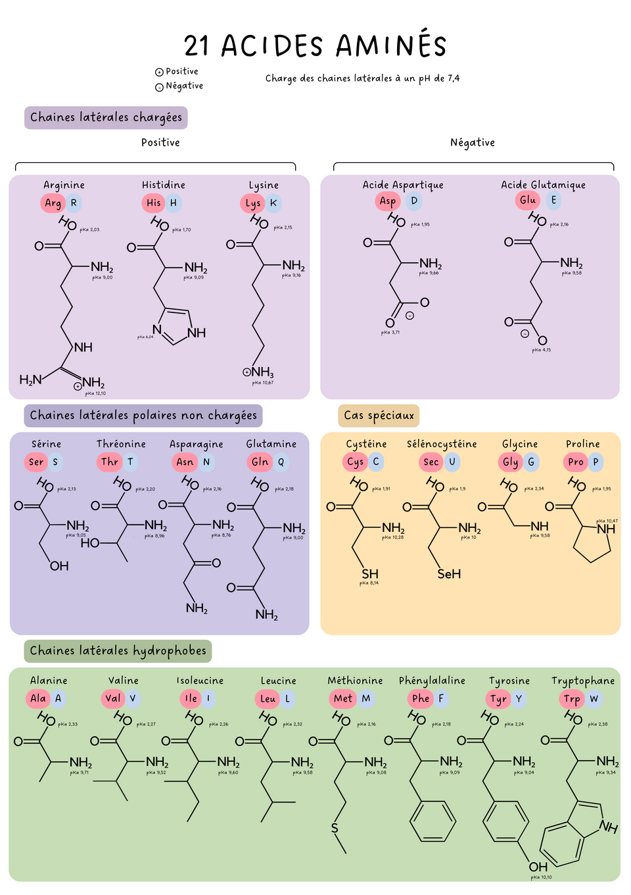
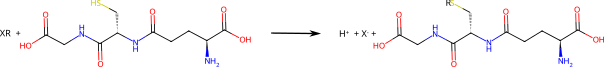

# Enjeux de la décarbonation en santé

Le design de protéines est un domaine en pleine expansion qui repose sur la compréhension des principes du repliement et de la stabilité des protéines. L’émergence des outils bioinformatiques, combinée aux avancées en ingénierie génétique, a transformé une discipline essentiellement expérimentale en un champ où la conception assistée par ordinateur et l’édition génomique jouent un rôle central. L’étude des protéines a d’abord reposé sur des approches expérimentales. La cristallographie aux rayons X, qui a révélé les premières structures tridimensionnelles (myoglobine en 1958, hémoglobine en 1960), a posé les bases de la compréhension des interactions qui stabilisent les protéines. Dans les années 1970, Christian Anfinsen a notamment étudié la thermodynamique du repliement et a montré que la structure d’une protéine est déterminée par sa séquence d’acides aminés. Dès les années 1980, les premières tentatives de modélisation par ordinateur ont émergé avec des outils basés sur la dynamique moléculaire (CHARMM, AMBER) et des approches énergétiques visant à prédire la structure d’une protéine à partir de sa séquence. Cependant, ces méthodes restaient limitées par la puissance de calcul et la complexité du repliement des protéines. Dans les années 1990, les premiers outils spécifiquement dédiés au design de novo des protéines ont été développés. Un tournant majeur a été l’apparition du logiciel ROSETTA, conçu par David Baker et son équipe, qui a permis la conception de protéines totalement nouvelles (Top7 en 2003). Ce logiciel, en combinant des approches de modélisation énergétique et de minimisation conformationnelle, a ouvert la voie à la création de protéines aux fonctions ciblées.

En parallèle, l’essor de la biologie de synthèse a été accéléré par le développement du système CRISPR-Cas9, qui permet de modifier, insérer ou supprimer des gènes avec une précision inégalée, facilitant ainsi l’ingénierie de protéines in vivo. Il est, entre autres, utilisé aujourd’hui pour optimiser des protéines conçues grâce à la bioinformatique, accélérant leur validation et leur intégration dans des cellules modifiées.

Depuis les années 2010, le design de protéines a connu une accélération spectaculaire grâce aux avancées en intelligence artificielle et en apprentissage profond. L’apparition d’AlphaFold2 (DeepMind, 2020), capable de prédire des structures avec une précision comparable à celle des méthodes expérimentales, a bouleversé le domaine. Plus récemment, des modèles de design génératif, comme ProteinMPNN ou RFdiffusion, permettent désormais de concevoir des protéines aux fonctions inédites, ouvrant des perspectives en santé, en biotechnologie et en matériaux bio-inspirés. L’intégration de l’IA, de CRISPR et des outils de bioinformatique crée aujourd’hui un écosystème où la conception et l’application de nouvelles protéines se font à une vitesse inégalée.

Les glutathion S-transférases (GST) forment une superfamille de protéines omniprésentes et multifonctionnelles. Leur rôle principal est de catalyser la réaction de conjugaison entre le glutathion (GSH) et un xénobiotique afin de l’éliminer. L’interaction entre les insectes et les composés phytochimiques crée une pression de sélection très importante, qui favorise le développement de protéines de détoxication très efficaces et versatiles. Par exemple, *Drosophila melanogaster* possède 36 GST différentes réparties en 6 classes, ce qui fait de ce protéome un ensemble de choix pour la création d’enzymes aux propriétés catalytiques nouvelles ou améliorées. Ce travail pratique vise donc à présenter une analyse d’une GST de la classe Delta à travers divers outils d’analyse bioinformatique, ainsi qu’une procédure d’optimisation de la séquence dans le but de créer une nouvelle GST.

# Travail pratique :
## 1. Relation séquence-structure

L'ensemble des structures de protéines résolues expérimentalement est répertorié dans la base de données [Protein Data Bank](https://www.rcsb.org/) et contient environ 240 000 structures, tandis que l'ensemble des centaines de millions de séquences connues est répertorié dans la base de données [UniProt](https://www.uniprot.org/). Dans un premier temps :

- Identifiez la séquence d'acides aminés de la GSTD1 de *Drosophila melanogaster*, ainsi que la/les éventuelle(s) structure(s) expérimentale(s).

- Réalisez, à l'aide d'[AlphaFold](https://alphafoldserver.com/), une prédiction de structure pour cette séquence de protéine.

**Attention** : la GSTD1 est homodimérique. Cela signifie que sa structure contient deux copies de la même chaîne protéique.

- À l'aide du logiciel de visualisation PyMOL, comparez globalement votre prédiction de structure avec la structure [*3EIN*](https://www.rcsb.org/structure/3EIN), téléchargeable au format **PDB**. Que remarquez-vous ?

- Où se situe le glutathion ? Donnez un ensemble d'acides aminés en contact avec ce dernier.

**Aide** : on peut, dans un premier temps, essayer d'identifier les acides aminés avec PyMOL, puis utiliser le script `contacts.ipynb` qui permet d'identifier les acides aminés de manière automatique.

## 2. Affinité protéine-ligand

En principe, une enzyme fonctionnelle doit être capable de capter ses réactifs avec une bonne affinité afin de faciliter leur rencontre. La prédiction de cette affinité est aujourd'hui un facteur déterminant pour la conception *in silico* d'enzymes artificielles. Le logiciel de modélisation moléculaire ROSETTA contient un ensemble de fonctionnalités qui permettent justement un tel calcul. On appelle **affinité de liaison** la quantité :

$$
    \Delta G = G_{\text{lié}} - G_{\text{séparé}}
$$

où $G$ est l'énergie du système, prenant en compte la protéine et le ligand. Dans l'état lié, le ligand se trouve dans son site de fixation, tandis que dans l'état séparé, le ligand n'interagit plus du tout avec la protéine. La quantité $\Delta G$ s'interprète alors comme l'énergie à apporter au système pour arracher le ligand de son site de fixation. Si $\Delta G \ge 0$, le système dans son état séparé est plus stable, ce qui signifie que la protéine repousse son ligand. On observe en général des $\Delta G < 0$, et l'affinité protéine-ligand est d'autant plus forte que $\Delta G$ est négatif.

- À partir du script `rosetta_affinity.ipynb`, calculez l'énergie de la structure `GSTD1+GSH.pdb`.
- À l'aide du logiciel PyMOL et de la commande [drag](https://pymol.org/dokuwiki/doku.php?id=command:drag), créez une structure `GSTD1+GSH_split.pdb`.
- Estimez ainsi l'affinité GSTD1–GSH.

**Aide** : par la suite, on pourra utiliser la fonction `binding_affinity`, qui implémente cette même logique et retourne directement la valeur d'affinité en unités d'énergie de Rosetta (REU).

- Vérifiez que la fonction `binding_affinity` donne une valeur similaire à celle obtenue précédemment.

## 3. Exploration dans l'espace des séquences de la GSTD1

Les acides aminés sont les composants élémentaires des chaînes protéiques. Il en existe 21 différents dans le domaine du vivant, et la séquence précise d'acides aminés définit aussi bien sa structure que sa fonction. Réaliser un **design** de protéine artificielle revient à trouver une ou plusieurs séquences capables de se replier et ayant des propriétés physico-chimiques contrôlées. Ce travail nécessite d'explorer un ensemble de séquences potentiellement gigantesque. La GSTD1 comporte par exemple 209 acides aminés. L'ensemble des séquences ayant une telle longueur est donc de $21^{209} \approx 2 \times 10^{276}$ séquences différentes.

*Source : Wikipedia.org*

Certaines applications dites *de novo* cherchent de nouvelles structures de protéines et sont donc contraintes d'explorer un tel espace. Dans ce travail, nous nous intéressons à l'optimisation de l'affinité entre une GST et son ligand. Modifier des acides aminés qui ne se trouvent pas dans le site de fixation est donc une approche inefficace, puisque l'écrasante majorité des acides aminés de la protéine n'interagissent que très peu avec le ligand. Additionnellement, les GST possèdent un acide aminé dit « actif » (sérine n°10 pour la GSTD1) qui interagit avec l'hydrogène du GSH pour faciliter la rupture de sa liaison covalente avec le soufre. Il est connu dans la littérature que des modifications de cet acide aminé entraînent une baisse significative de l'efficacité de l'enzyme. Nous n'appliquerons donc des mutations que sur les résidus du site de fixation du GSH précédemment identifiés, en excluant la Ser10.

On caractérise l'impact d'une mutation par la quantité :
$$
    \Delta \Delta G = \Delta G_{\text{mutant}} - \Delta G_{\text{natif}}
$$

Si $\Delta \Delta G \ge 0$, l'affinité protéine-ligand du mutant est plus grande (moins négative) que celle du système natif : la mutation est donc défavorable. À l'inverse, une mutation entraînant un $\Delta \Delta G < 0$ est favorable !

- Combien de mutations **uniques** existe-t-il ?

- À l'aide du script `rosetta_mutate.ipynb`, testez certaines de ces mutations et identifiez si elles sont favorables ou non.

- Combien de **paires** de mutations existent-elles (c'est-à-dire combien d'enchaînements de deux mutations existe-t-il) ?

Dès que l'on cherche à explorer des combinaisons de mutations, le nombre de possibilités augmente de manière significative. Il nous est donc impossible d'explorer l'ensemble de l'espace des séquences, même une fois ce dernier réduit. Pour contourner cette difficulté, une stratégie possible est d'utiliser des méthodes d'échantillonnage appelées [méthodes de Monte Carlo par chaînes de Markov](https://fr.wikipedia.org/wiki/M%C3%A9thode_de_Monte-Carlo_par_cha%C3%AEnes_de_Markov) (MCMC). On commence par évaluer un $\Delta G_{\text{référence}}$, qui représente pour l'instant l'affinité protéine-ligand du système natif. Puis, pour un nombre prédéfini d'itérations, on tire au hasard une mutation parmi l'ensemble des mutations uniques autorisées, et l'on évalue ainsi le $\Delta G_{\text{mutant}}$ associé à cette mutation, ainsi que le $\Delta \Delta G$. Si la mutation est favorable ($\Delta \Delta G \le 0$), elle est dite **acceptée** et le mutant devient la nouvelle référence. Dans le cas contraire, la mutation peut être acceptée ou non avec une probabilité donnée par le critère de Metropolis :
$$
    P_{\text{acceptation}} = \exp \left( \frac{-\Delta \Delta G}{k_B T} \right)
$$

Ainsi, si $\Delta \Delta G$ est très grand devant le paramètre $k_B T$, alors la mutation est rejetée avec une quasi-certitude. Cependant, une mutation faiblement perturbante pourra tout de même être acceptée avec une probabilité non négligeable.

- À partir du script `rosetta_MCSS.ipynb`, réalisez une simulation de Monte Carlo dans l'espace des séquences (MCSS) de la GSTD1.

- Par rapport à l'affinité GST–GSH initiale, quel est l'ordre de grandeur de l'amélioration ?

- Quel est l'impact du paramètre `N_ITER` ?

- Quel est l'impact du paramètre `TEMP` ? Que se passe-t-il lorsque ce dernier est très grand ? Lorsqu'il est nul ?

- Proposez un choix optimal pour le paramètre `TEMP`.

# Conclusion

L'objectif de ce travail était de découvrir par la pratique certains outils de modélisation permettant la création de protéines artificielles. Bien que le protocole mis en place soit extrêmement simpliste, il permet de comprendre les problématiques du domaine. Aujourd'hui, des méthodes basées sur des modèles d'apprentissage profond existent et permettent une exploration encore plus vaste de l'espace des séquences. L'essor de ces nouvelles méthodes de modélisation des protéines aura probablement un impact important, aussi bien en médecine que dans l'industrie pharmaceutique. En effet, de nombreuses étapes de production pharmaceutique reposent encore sur des procédés chimiques coûteux en énergie, utilisant des solvants organiques et générant des déchets. La conception d'enzymes capables de catalyser ces réactions dans des conditions plus douces (température ambiante, milieu aqueux) permettrait de réduire significativement l'empreinte carbone de ces procédés.

Par exemple, des enzymes artificielles pourraient être développées pour améliorer la synthèse de principes actifs pharmaceutiques avec une meilleure sélectivité, limitant ainsi les sous-produits et les étapes de purification. De même, le design de protéines impliquées dans la dégradation de polluants ou de résidus médicamenteux pourrait contribuer à réduire l'impact environnemental des rejets hospitaliers. Enfin, l'optimisation de protéines thérapeutiques plus stables pourrait diminuer les besoins en chaîne du froid, réduisant ainsi les coûts énergétiques liés au stockage et au transport.

Ainsi, les outils explorés dans ce travail s'inscrivent dans une dynamique plus large, où la biologie computationnelle et le design de protéines participent non seulement à l'innovation médicale, mais également à la transition vers des systèmes de santé plus durables.
